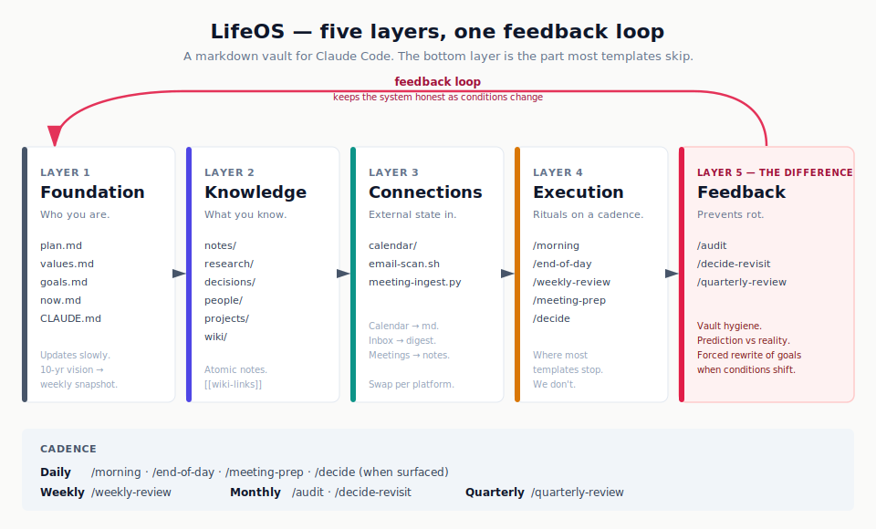

# LifeOS

**An opinionated, agentic life-OS for Claude Code.** A lived-in scaffold, not a starter kit — every file shape, skill, and review cadence comes from running it for real, not from speculation.

A "life-OS" is a personal operating system in markdown: a vault for journaling, decisions, projects, notes, and people — paired with daily, weekly, and quarterly review skills that keep it from rotting.



**Built for** solo knowledge workers, researchers, engineering leads, founders, and PIs juggling many threads — anyone who already lives in markdown and wants an AI to enforce review discipline.

**This is an artifact, not a project.** Fork freely (CC BY 4.0). Issues are disabled. PRs are not actively reviewed. If something here is wrong for your life, change it — don't expect upstream fixes.

---

## See it in action

A scripted `/morning` — 30-second loop:



Then read [`examples/`](examples/) for filled-in samples of every file kind: a real-feeling `now.md`, a populated `inbox.md`, a substantive daily journal entry, a `/weekly-review` output, a prospective decision and the same decision revisited three months later, an atomic note, and a person record. Templates show you the shape; examples show you the standard.

---

## What this gets right

Most public Claude Code vault templates are scaffolds. They look great at launch and rot within 2-3 months because they don't include the feedback layer — the periodic audit, the decision revisit, the quarterly forced rewrite. This one does.

Specifically:

- **A vault audit skill (`/audit`)** that scores the vault, flags stale goals / broken wiki-links / orphan notes / decisions missing revisit dates, and writes the audit log to `research/vault-audits/` so trends are visible across runs.
- **Prospective decision capture (`/decide`)** in Patrick Collison / Farnam Street format: alternatives, prediction at 30/90/365 days, confidence, worst case, what would change my mind, revisit date.
- **Decision revisit (`/decide-revisit`)** — the periodic accounting of "what I predicted vs what actually happened." Most templates have decisions; almost none revisit them.
- **A real quarterly review (`/quarterly-review`)** that *forces* either a goals.md rewrite or formal legacy acceptance — the most common failure mode is a stale annual plan that never gets honestly re-evaluated.
- **A "critical partner not completer" philosophy** wired into CLAUDE.md, with concrete push-back examples baked into every skill prompt.

## A typical week

Friday, 4:17 pm. `/weekly-review` fires from a scheduled routine. It reads the last seven daily journals, the inbox, `now.md`, and the GitHub state. Three minutes later it surfaces: you've mentioned the same blocked migration three times this week without progress, two inbox items have aged past 14 days, and a decision you captured in April has a revisit date that just passed. It drafts `week-19.md`, updates `now.md`, and forces one question: *make the migration call now or formally park it past Q3?* You pick. The week closes.

Tuesday, 9:00 am. `/morning` ran while you were still on coffee. It pulled today's calendar, scanned email for actionable bullets, read yesterday's journal, and proposes three priorities. One of them has been on the list for three days — it asks you directly: *do it today or defer past this week?* You decide. The journal file is written. You're done in five minutes.

After 90 days, you'll have ~12 weekly reviews, 3-8 decisions captured prospectively, 30+ atomic notes, and a `now.md` that a colleague could read to brief themselves in 60 seconds.

## How this is different from …

| Tool | What it gives you | What's missing (that LifeOS adds) |
|------|-------------------|-----------------------------------|
| **Obsidian + Daily Notes plugin** | Markdown vault, wiki-links, graph view, daily template | No skills, no review cadence, no decision-revisit loop, no critical-partner AI |
| **Notion + AI** | Database + AI for one-shot Q&A | Not a file system, not git-friendly, no enforced rhythm, hard to run scheduled agents on |
| **Mem / Reflect / similar** | Daily journal + AI search | Closed format, no decision records, no audit loop, can't customize the skills |
| **Bullet journal + a habit tracker** | Discipline, no software | No knowledge graph, no AI partner, no automated weekly synthesis |

LifeOS is markdown + git + skills. Nothing proprietary. The discipline is enforced by the skills, not by your willpower.

## Quick start

```bash
# 1. Clone (use either)
gh repo clone seandavi/lifeos-template ~/Documents/lifeos
# or:
git clone https://github.com/seandavi/lifeos-template.git ~/Documents/lifeos
cd ~/Documents/lifeos

# 2. From within Claude Code (anywhere), run:
/init
# Answers a few questions (vault path, name, timezone, email tooling)
# and substitutes <VAULT_ROOT> throughout the skill files + CLAUDE.md.

# 3. Tour the system:
/orient
# 5-minute walkthrough of the layers and skills.

# 4. Start the daily rhythm:
/morning
# (the next morning)
```

That's it. Everything else is on-demand or scheduled.

## Five layers

| Layer | What | Files / Skills |
|-------|------|---------------|
| **Foundation** | Who you are, where you're going | `plan.md`, `values.md`, `journal/{{YYYY}}/goals.md`, `now.md`, `CLAUDE.md` |
| **Knowledge** | What you know | `notes/`, `research/`, `decisions/`, `people/`, `projects/`, `wiki/`, `raw/`, `templates/` |
| **Connections** | External state coming in | `calendar/export-calendar.sh`, `scripts/email-scan.sh`, `scripts/meeting-ingest.py` |
| **Execution** | Rituals that run on a cadence | `/morning`, `/end-of-day`, `/weekly-review`, `/meeting-prep`, `/decide` |
| **Feedback** | The layer that prevents rot | `/audit`, `/decide-revisit`, `/quarterly-review` |

Plus two bootstrap skills (`/init`, `/orient`) for getting set up. Each skill self-documents in `.claude/skills/<name>/SKILL.md` — read those for the full step lists.

## External dependencies

**Minimum viable path: Claude Code + git.** Everything else is optional and swappable.

This template was built on macOS, so the calendar and email integrations default to macOS tools. None of them are essential — each has a documented swap-out point. Plan to spend ~30 minutes adapting the Connections layer if you're on Linux or Windows.

| Dependency | What for | Required? | Cross-platform swap |
|-----------|----------|----------|---------------------|
| [Claude Code](https://claude.com/claude-code) | Skill runtime | **Yes** | macOS, Linux, Windows (WSL) |
| `git` | Vault is a git repo | Strongly recommended | Universal |
| `icalBuddy` (`brew install ical-buddy`) | Calendar → markdown | No — calendar export is optional | **Linux:** `gcalcli` or `khal`. **Windows:** PowerShell + Outlook COM, or `gcalcli` under WSL. Rewrite `calendar/export-calendar.sh` to your tool's output. |
| `osascript` + macOS Mail.app | Email scan (AppleScript bridge) | No — email scan is optional | **Linux:** `notmuch`, `mu`, or `mbsync` + IMAP. **Windows:** PowerShell + Outlook COM, or Gmail/Outlook web APIs. Rewrite `scripts/email-scan.sh` to emit the same markdown shape. |
| `gemini` CLI | LLM that filters the raw email dump into actionable bullets | No — swap via `EMAIL_LLM` env var | Any LLM CLI works: `claude -p`, `ollama`, `llm` (Simon Willison's), or any OpenAI-compatible tool. |
| `gh` CLI | GitHub state in `/weekly-review` | No — skill skips if not authed | Universal, or remove the `gh` calls |

## Editor / IDE setup

You can edit this vault in any markdown-aware tool. The two most common choices:

### Obsidian (recommended)

Obsidian renders `[[wiki-links]]` natively, shows the connection graph, and works directly on the file system — no import/export. Setup:

1. Install [Obsidian](https://obsidian.md/).
2. Open Obsidian → "Open folder as vault" → select this vault's root.
3. Recommended core plugin tweaks (Settings → Core plugins):
   - Enable: **Daily notes** (point to `journal/{{year}}/{{month}}/` with template `templates/daily-journal.md`)
   - Enable: **Templates** (folder: `templates`)
   - Enable: **Graph view** (the wiki-links pay off here)
   - Enable: **Backlinks**
   - Disable: **File recovery** (the git history serves this purpose better)
4. Recommended community plugins (optional):
   - **Dataview** — query the vault as a database (e.g., list all open decisions, all "Active" projects)
   - **Calendar** — sidebar calendar that opens daily notes
   - **Periodic Notes** — extends Daily Notes with weekly/monthly/quarterly variants matching this template's structure
5. `.obsidian/workspace.json` is gitignored (volatile UI state — changes every time you close Obsidian). The rest of `.obsidian/` (your config + graph settings) is tracked.

### VS Code / Cursor / Zed

Markdown works fine; wiki-links won't auto-resolve in preview, but extensions like **Markdown All in One**, **Foam**, or **Dendron** add link support.

For visual graph: keep Obsidian open alongside as a graph-viewer-only.

### Plain editor (Vim, Emacs, etc.)

Works perfectly. The wiki-links are just `[[text]]` patterns; grep + project-wide search gets you 90% of the connection navigation.

## Scheduling skills

By default, the skills are user-invoked (`/morning`, `/weekly-review`, etc.). To run them automatically — for example, nightly `/meeting-prep` while your laptop is closed, or Friday `/weekly-review` at 4pm — use **Claude Code Routines** (cloud-scheduled agents) or `/loop` for in-session repetition.

**Read:** [Claude Code Scheduled Tasks docs](https://code.claude.com/docs/en/scheduled-tasks)

Suggested baseline schedule (paste each into `/schedule` once `/init` is done):

```
/schedule nightly meeting prep — run /meeting-prep at 9:47pm local every day
/schedule weekly review nudge — run /weekly-review at 4:17pm local every Friday
/schedule monthly audit — run /audit at 9:13am local on the 1st of every month
/schedule decision revisit — run /decide-revisit at 9:23am local on the 15th of every month
/schedule quarterly review — run /quarterly-review at 9:33am local on the 1st of January, April, July, October
```

(Off-zero minute marks intentionally — avoids the global cron load spike on `:00`.)

**Don't schedule `/end-of-day` or `/decide`.** Those are user-driven: fire when you're wrapping up for the day, or when a decision actually surfaces in conversation.

## Philosophy

The CLAUDE.md is the operating manifest — read it for the long version. The short version:

- **Critical partner, not helpful completer.** Skills push back. They name what's being avoided. They say "looks good" only when something is actually good.
- **The constraint is the design discipline.** Daily Franklin journal + weekly review + monthly audit + quarterly rewrite is enough scaffolding to prevent drift without becoming busywork.
- **The feedback layer is non-negotiable.** Anyone can build a vault; few build the audit/revisit/quarterly loop that keeps it from rotting.
- **Real users, named, from day one.** The skills assume the vault is in active use, not theoretical.

## Customization

Everything is editable. A few specific levers:

- **Skill names.** Flat names (`/morning`, `/audit`) by default. If you mix this vault with other skill collections and worry about collisions, rename them in `.claude/skills/<name>/SKILL.md`'s `name:` field — `lifeos-morning`, or anything you prefer. Plugin-style `lifeos:*` namespacing is the right pattern if you eventually distribute this as a Claude Code plugin.
- **Cadence.** The weekly review fires on Fridays in the default schedule. Move it to Sunday if that fits better. Some people prefer monthly over weekly; that works too — just delete `/weekly-review` and rely on `/audit` + `/quarterly-review`.
- **Layers.** If you don't need the `wiki/` (structured domain knowledge) or `raw/` (source ingest), delete them. The other skills don't depend on them.
- **Diary.** `personal/diary.md` is optional. If you don't want it, delete the file and remove Step 3 from the morning skill.

## Credit

Built by [Sean Davis](https://github.com/seandavi) on top of Anthropic's Claude Code. Influenced by:

- John Carmack's `.plan` files
- Benjamin Franklin's morning/evening questions and virtues system
- Patrick Collison's decision-revisit principle ("good at re-deciding")
- Andrej Karpathy's [LLM Wiki gist](https://gist.github.com/karpathy/442a6bf555914893e9891c11519de94f) (raw → wiki → schema pattern)
- Nick Milo's [Linking Your Thinking](https://www.linkingyourthinking.com/) (atomic notes + connection-as-thinking)
- Tiago Forte's BASB (with the AI-second-brain caveat)
- Max Frenzel's [daily AI review system](https://maxfrenzel.medium.com/the-daily-ai-enabled-review-system-that-changed-how-i-work-51944a948caf)

## License

[CC BY 4.0](https://creativecommons.org/licenses/by/4.0/). See `LICENSE`. If you ship a meaningful adaptation publicly, link back as a courtesy.
